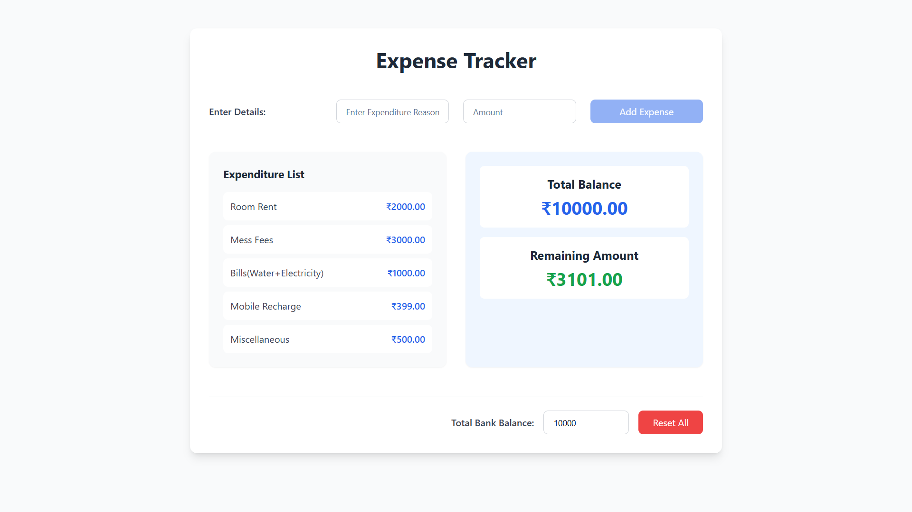

# Expense Tracker

A simple and intuitive Expense Tracker application built with React and Tailwind-CSS. This app helps users keep track of their expenditures and manage their budget effectively.

## Table of Contents

- [Features](#features)
- [Screenshot](#screenshot)
- [Setup](#setup)
- [Usage](#usage)
- [Contributing](#contributing)
- [License](#license)

## Features

- Add expenditure details with a reason and amount.
- Display the list of expenditures and their respective amounts.
- Calculate and display the remaining amount from the total budget.
- User-friendly interface with responsive design.

## Screenshots


<div style="display: flex; justify-content: space-between;">
  
  
</div>

## Setup

Follow these steps to set up the project locally:

1. **Clone the repository:**

   ```bash
   git clone https://github.com/kriti-raj/Budget-Manager-App.git

   cd Budget-Manager-App

   ```

2. **Install the dependencies:**

   ```bash
   npm install

   ```

3. **Run the development server:**

   ```bash
   npm run dev

   ```

4. **Open your browser and navigate to:**
   ```bash
   http://localhost:5173
   ```

## Usage

1. Enter your total budget in the provided input field.
2. Add expenditure details by entering the reason and amount, then click "Calculate".
3. View the list of expenditures and the remaining amount.

## Contributing

_Contributions are welcome! If you'd like to contribute, please fork the repository and make changes as you'd like. Pull requests are warmly welcome._

1. Fork the project
2. Create your feature branch (git checkout -b feature/AmazingFeature)
3. Commit your changes (git commit -m 'Add some AmazingFeature')
4. Push to the branch (git push origin feature/AmazingFeature)
5. Open a pull request

## License

This project is licensed under the Apache License - see the LICENSE file for details.
